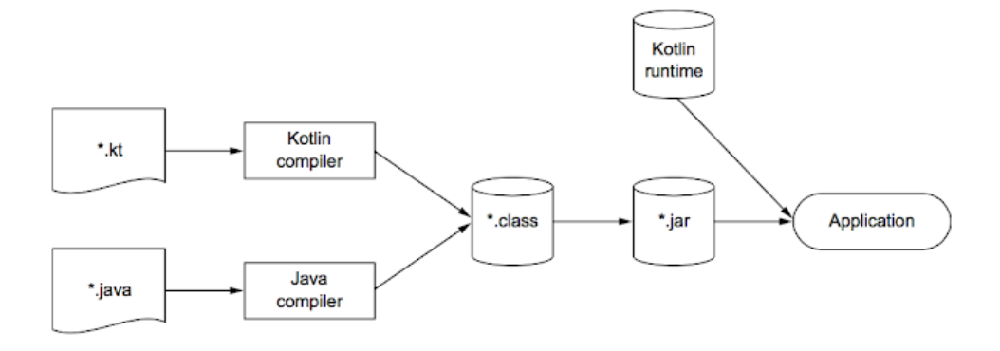

What is develop?

  1. server developer
  Role: interaction between users. For example saving play time of video play bar and show same time at another device with same acount.
  Also saving various data in to the artifitial cloud system
  
  2. Client developer
  Role: It is about making GUI(Graphic User Interface)
  
  * Android
  Kotlin - Replacement of Java which is newest langague, used in Google
  
  Java - Most of the code is written in Java, such as comments or other examples. Probably developers need to know how to read Java statement to understand the code.
  
  Without crashing with same file, Java and Kotlin can be swtiched automatically and also compatible

  .

  We can find various reasons to use Kotlin instead of Java, because of effeciency on the code 
 
  * IOS
  * Web
  * All together (Using React Native, Ionic)
  
  3. Machine learning developer
  
Develop process
 
* Waterfall
 
Various Input -> Operation -> Design -> Development(Server) -> Development(Client) -> Check -> Develop -> Release

* Agile

Cycle of waterfall is very short compare to agile. Basic terminology is same as waterfall, however it has minimal requirements to pass
each steps.

What is DevOps?

DevOps is mixed words of development and operation. It emphasize that automatic control managemnet theory in software development.
Development and operation should be interactive.

For the tool-chains it uses Jira, Jira confluence, Bitbucket, Jenkins and for the cloud Cloud sercers such as EC2, S3, RDS and Docker.

